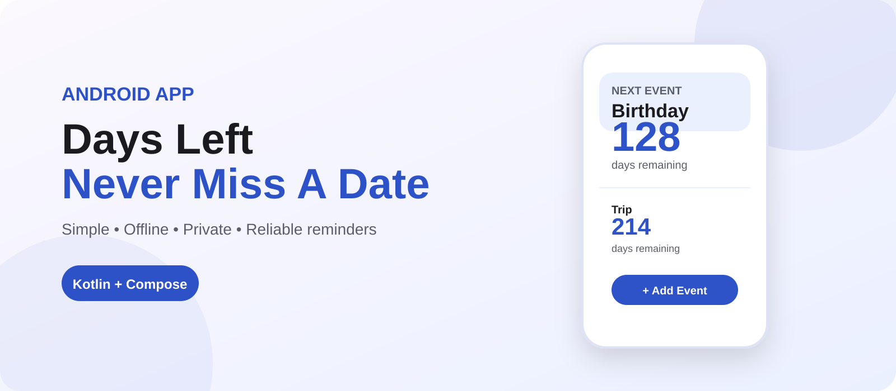
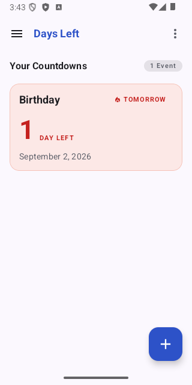
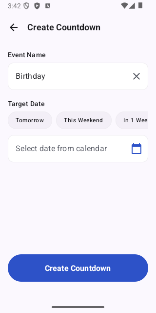
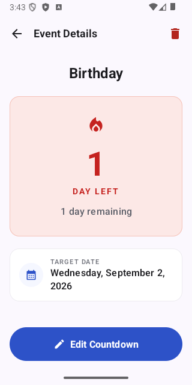
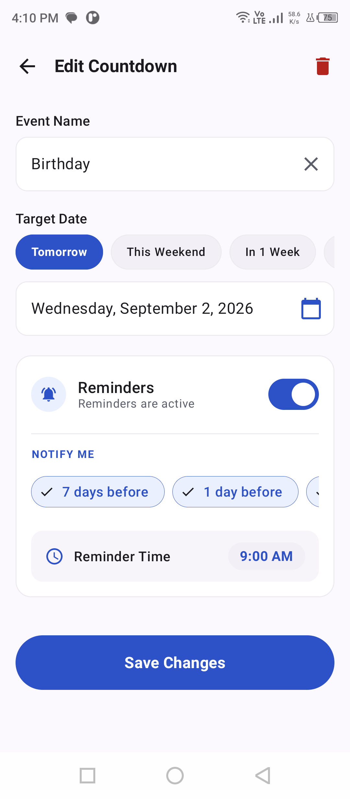

<p align="center">
  
</p>

# Days Left

A minimal, modern, offline-first Android countdown application designed to help you track the days remaining until your important dates and milestones.

---

## Features

- **Event Countdowns** — See exact days left until birthdays, exams, vacations, anniversaries, and holidays.
- **Smart Status Badges** — Visual indicators for *Urgent* (<= 2 days), *Upcoming*, *Today*, and *Passed* events.
- **Local Reminders & Alarms** — Deterministic local notifications at 7 days before, 1 day before, and on the day of the event at a customizable time.
- **Deep Linking** — Tapping a notification opens the exact event detail view instantly.
- **Boot & Timezone Resilience** — Scheduled reminders are automatically reconciled after device reboots, time changes, or timezone shifts.
- **100% Offline-First** — All data is persisted locally in an on-device SQLite Room database. No accounts, logins, cloud services, or internet access required.
- **Official Branding & Theming** — Designed with official Days Left brand colors (`#2D52C8`), with seamless support for both Light and Dark mode.
- **Quick Date Presets & Templates** — One-tap chips for *Tomorrow*, *This Weekend*, *In 1 Week*, *In 1 Month*, and quick templates for common events.

---

## Screenshots

| Home Screen | Add Countdown | Event Details | Edit Countdown |
| :---: | :---: | :---: | :---: |
|  |  |  |  |

---

## Tech Stack

- **Kotlin** — 100% Kotlin codebase with idiomatic coroutines and flows.
- **Jetpack Compose** — Modern declarative UI toolkit.
- **Material 3** — Material You typography, shapes, and color tokens.
- **Room Database** — Robust local SQLite persistence with TypeConverters and schema migrations.
- **Navigation Compose** — Type-safe navigation routing with Kotlinx Serialization.
- **StateFlow & Coroutines** — Unidirectional Data Flow (UDF) with lifecycle-aware state management.
- **AlarmManager & BroadcastReceivers** — Deterministic background reminder engine.

---

## Architecture

Days Left follows Clean Architecture principles with **MVVM (Model-View-ViewModel)** and **Unidirectional Data Flow (UDF)**:

```
+-------------------------------------------------------------+
|                     Presentation Layer                      |
|                                                             |
|   HomeScreen       AddEventScreen   EditScreen    Details   |
|        |                 |               |           |      |
|   HomeViewModel    AddEventVM       EditEventVM   DetailsVM |
|        \                 |               |          /       |
+---------\----------------+---------------+---------/--------+
           \               |               |        /
            v              v               v       v
+-------------------------------------------------------------+
|                         Data Layer                          |
|                                                             |
|                      EventRepository                        |
|                             ↓                               |
|                         EventDao                            |
|                             ↓                               |
|                     Room AppDatabase                        |
+-------------------------------------------------------------+
```

### Project Structure

```
app/src/main/java/com/daysleft/
├── DaysLeftApplication.kt          # Application entry point & AppContainer setup
├── MainActivity.kt                 # Single activity with edge-to-edge Compose & deep-link routing
├── di/
│   └── AppContainer.kt             # Lightweight service locator for application singletons
├── data/
│   ├── local/                      # Room entity, DAO, Database, and TypeConverters
│   └── repository/                 # EventRepository interface and implementation
├── reminder/
│   ├── ReminderType.kt             # Reminder intervals & notification payload formulas
│   ├── ReminderTimeCalculator.kt   # Calendar-aware alarm timestamp calculations
│   ├── ReminderScheduler.kt        # AlarmManager scheduling & cancellation
│   ├── ReminderReceiver.kt         # BroadcastReceiver for posting notifications
│   └── BootAndAlarmReceiver.kt     # System event receiver for alarm reconciliation
├── ui/
│   ├── home/                       # Home screen & HomeViewModel
│   ├── add/                        # Add event screen & AddEventViewModel
│   ├── edit/                       # Edit event screen & EditEventViewModel
│   ├── details/                    # Event details screen & EventDetailsViewModel
│   ├── components/                 # Reusable Compose components (Cards, Dialogs, Chips, Hero)
│   └── theme/                      # Colors, typography, shapes, spacing, and MaterialTheme
├── navigation/
│   └── AppNavigation.kt            # Type-safe navigation graph & routes
└── util/
    ├── DateUtils.kt                # Date math, countdown calculations, and preset helpers
    └── EventValidator.kt           # Shared validation rules for event forms
```

---

## Reminder & Alarm Engine

- **Deterministic Request Codes** — Each reminder is calculated via $(\text{eventId} \times 10) + \text{reminderType.idOffset}$, eliminating request code collisions between events.
- **Exact Alarm Fallback** — Uses `AlarmManager.setExactAndAllowWhileIdle()` when permission is granted, with graceful non-fatal fallback to standard alarms on restricted devices.
- **System Change Reconciliation** — `BootAndAlarmReceiver` automatically reschedules future alarms upon:
  - Device reboot (`android.intent.action.BOOT_COMPLETED`)
  - App package update (`android.intent.action.MY_PACKAGE_REPLACED`)
  - Timezone change (`android.intent.action.TIMEZONE_CHANGED`)
  - System time set (`android.intent.action.TIME_SET` / `android.intent.action.TIME_CHANGED`)
  - System date change (`android.intent.action.DATE_CHANGED`)

---

## Permissions

Days Left strictly requests only the permissions required for local reminders:

| Permission | Purpose |
|---|---|
| `POST_NOTIFICATIONS` | Allows displaying reminder notifications on Android 13+ (API 33+). |
| `RECEIVE_BOOT_COMPLETED` | Allows rescheduling active alarms after device restart. |
| `USE_EXACT_ALARM` / `SCHEDULE_EXACT_ALARM` | Enables precise notification timing for countdown deadlines. |

> Zero internet, location, contact, storage, or camera permissions are requested.

---

## Offline-First & Privacy

Days Left is 100% offline-first. All data is saved exclusively in an on-device SQLite database managed by Room. No analytics, tracking, advertising SDKs, cloud backends, or network requests are included.

For full privacy information, see [PRIVACY.md](PRIVACY.md).

---

## Development & Build Instructions

### Prerequisites

- Android Studio Ladybug (2024.2.1+) or newer
- JDK 17 or JDK 21
- Android SDK (Compile SDK 36, Min SDK 26)

### Build Debug APK

```powershell
.\gradlew.bat assembleDebug
```
The compiled APK will be generated at `app/build/outputs/apk/debug/app-debug.apk`.

### Run Unit Tests

```powershell
.\gradlew.bat testDebugUnitTest
```

### Run Instrumented Tests

```powershell
.\gradlew.bat connectedAndroidTest
```

---

## Contributing

Contributions, bug reports, and suggestions are welcome!

1. Fork the repository
2. Create your feature branch (`git checkout -b feature/amazing-feature`)
3. Commit your changes (`git commit -m 'feat: add amazing feature'`)
4. Push to the branch (`git push origin feature/amazing-feature`)
5. Open a Pull Request

---

## License

This project is licensed under the MIT License. See the [LICENSE](LICENSE) file for details.
