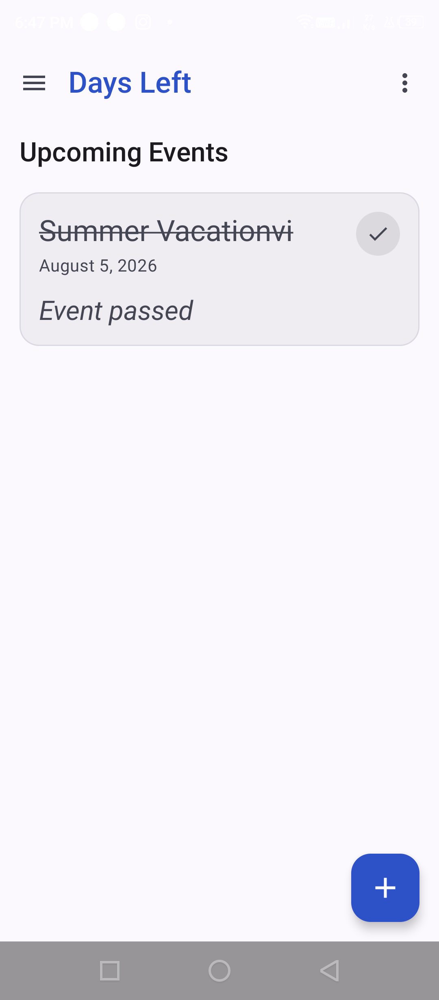
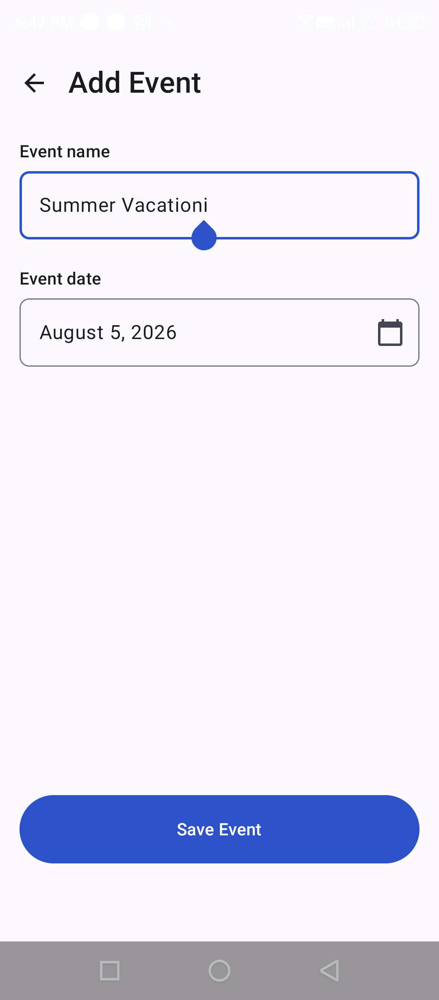
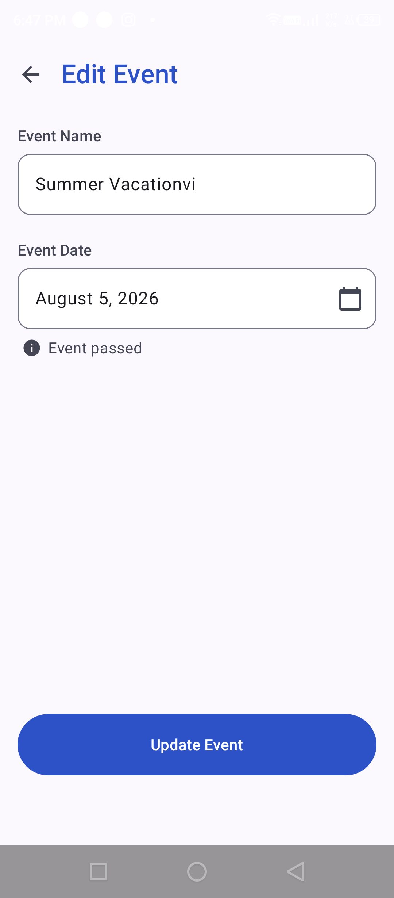
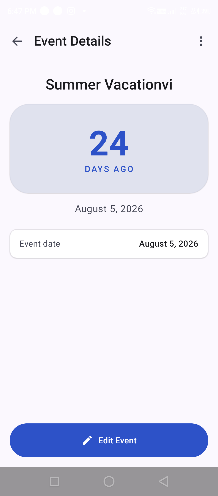

# Days Left

A simple offline Android countdown app for important dates.

## Features

- **Create countdown events** — Track the days remaining until birthdays, trips, holidays, or deadlines
- **Edit events** — Easily update event names and target dates with live countdown preview
- **Delete events** — Remove events with a safe confirmation dialog
- **Today and past event states** — Clear visual badges for active countdowns, events happening today, and past events
- **Offline local storage** — All data is stored locally on your device with Room SQLite
- **Simple Material 3 interface** — Clean, modern design following Material Design 3 guidelines
- **No account required** — Start using the app immediately without sign-up or logins
- **No unnecessary permissions** — Zero permissions requested (no network, camera, location, or storage permissions)

## Screenshots

| Home | Add Event | Edit Event | Event Details |
| :---: | :---: | :---: | :---: |
|  |  |  |  |

## Tech Stack

- **Kotlin** — 100% Kotlin codebase
- **Jetpack Compose** — Modern declarative UI toolkit
- **Material 3** — Modern Material You theme and components
- **Room Database** — Robust local SQLite persistence with TypeConverters
- **MVVM** — Clean separation of concerns with unidirectional data flow
- **Navigation Compose** — Type-safe navigation routes with Kotlinx Serialization

## Architecture

Days Left follows a clean MVVM (Model-View-ViewModel) architecture:

```
UI (Compose Screens & Components)
               ↓
ViewModel (StateFlow & Coroutines)
               ↓
Repository (Data abstraction layer)
               ↓
Room DAO (SQLite operations)
```

## Installation

To install the application directly on your Android device:

1. Download **`Days-Left-v1.0.0.apk`** from the website or GitHub Releases.
2. Open the downloaded APK file on your device.
3. If prompted by Android, allow installing apps from your browser or file manager.
4. Tap **Install** and launch **Days Left**.

## Build From Source

### Prerequisites

- Android Studio Ladybug (or newer) / Android SDK (compileSdk 36, minSdk 26)
- JDK 17 or JDK 21

### Build Steps

Clone the repository and run:

```powershell
.\gradlew.bat assembleDebug
```

The compiled APK will be generated at:
```
app/build/outputs/apk/debug/app-debug.apk
```

### Run Tests

Run unit tests:
```powershell
.\gradlew.bat test
```

Run connected instrumented tests on an emulator or physical device:
```powershell
.\gradlew.bat connectedAndroidTest
```

## Privacy

Days Left respects your privacy. All event data is stored exclusively on your device in a local database. No data is collected, tracked, transmitted, or shared. 

For full details, please review [PRIVACY.md](PRIVACY.md).

## Open Source

The complete source code for Days Left is open source and publicly available on GitHub. Contributions, issue reports, and feedback are welcome.

## License

This project is licensed under the MIT License. See the [LICENSE](LICENSE) file for details.
